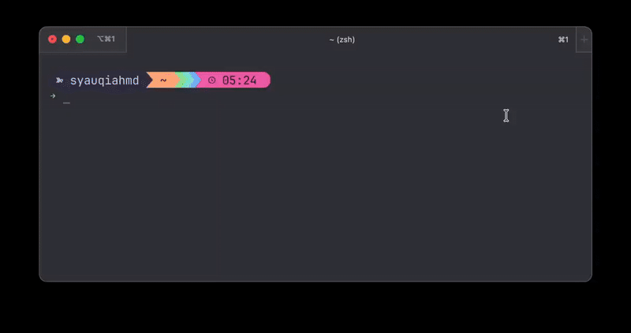

# Kubernetes Helper Scripts



`klog`, `kenv`, and `kdesc` are simple, interactive bash scripts designed to streamline common `kubectl` tasks.

They provide a user-friendly, numbered menu to select namespaces and resources, eliminating the need to type or copy and paste long names.

---

## Features

- **Interactive Selection**: Easily select namespaces and pods from a numbered list.
- **Interactive Loop**: After viewing logs, you can instantly search again, switch pods, or even change namespaces without restarting the script.
- **Colorful Interface**: Color-coded prompts and lists for better readability.
- **Keyword Filtering**: Instantly filter logs or environment variables using one or more keywords.
- **Log Following**: `klog` includes an option to stream logs in real-time (`kubectl logs -f`).
- **Flexible Log Tailing**: Specify the number of log lines to retrieve (e.g., the last 100 lines).
- **Zero Dependencies**: Written in pure bash with no external dependencies required.
- **Argument Support**: Pass in a namespace as an argument to skip the namespace selection menu (e.g., `./klog my-namespace`).

## Prerequisites

- `kubectl` must be installed and configured to point to a running Kubernetes cluster.

## Installation

An installation script is provided to automatically make the scripts executable and copy them to a suitable directory in your system's PATH.

1.  **Clone the repository or download the scripts.**

2.  **Navigate into the project directory:**
    ```bash
    cd kube-helper-scripts
    ```

3.  **Run the installation script:**
    ```bash
    chmod +x install.sh
    ./install.sh
    ```

The script will attempt to install the scripts to a user-local directory (like `~/.local/bin`) if it is in your `$PATH`. Otherwise, it will fall back to `/usr/local/bin`, which may prompt for a `sudo` password.

After installation, you may need to restart your terminal or source your shell profile (e.g., `source ~/.bashrc`) for the new commands to be available.

## Usage

Once installed, you can run the scripts directly from your terminal.

### klog

Run the script with `klog` or `klog <namespace>`.

The script will guide you through selecting a namespace and pod. You can then enter keywords to filter the logs, choose to follow them live, and specify how many lines to retrieve.

After the logs are displayed, a menu will appear, allowing you to start a new search, switch pods, or change namespaces.

```
$ klog
Please select a namespace:
1) default
2) dev
3) staging
Enter number for namespace: 2

Please select a pod from the namespace 'dev':
1) logger-dev-1-7787d59d78-j4m65
2) logger-dev-2-849d7ff58c-ghtgl
Enter number for pod: 1

Enter keywords to search (use ';' to separate): ERROR;timeout
Follow logs? (y/N): n
Enter number of log lines to fetch (default: 10, use -1 for all): 50

Searching logs for pod 'logger-dev-1-7787d59d78-j4m65' in namespace 'dev'...
[ERROR] 2025-09-21T20:00:00.000Z - A timeout occurred.
...

What do you want to do next?
1) Search again in the same pod ('logger-dev-1-7787d59d78-j4m65')
2) Select another pod in the same namespace ('dev')
3) Select another namespace
q) Quit
Enter your choice: q
Exiting.
```

### kenv

Run the script with `kenv` or `kenv <namespace>`.

```
$ kenv dev

Please select a pod from the namespace 'dev':
1) logger-dev-1-7787d59d78-j4m65
2) logger-dev-2-849d7ff58c-ghtgl
Enter number for pod: 1

Enter keywords to filter environment variables (use ';' to separate): API

Searching environment variables for pod 'logger-dev-1-7787d59d78-j4m65' in namespace 'dev'...
API_KEY=s3cr3t-v4lu3
API_URL=https://api.example.com
```

### kdesc

Interactively describe any Kubernetes resource.

```
$ kdesc
Please select a resource type:
1) pod
2) service
3) deployment
...
Enter number for resource type: 3

Please select a namespace:
1) default
2) dev
...
Enter number for namespace: 2

Please select a resource from dev to describe:
1) my-app-deployment
...
Enter number for resource: 1

Describing deployment/my-app-deployment in namespace dev...
Name:                   my-app-deployment
Namespace:              dev
CreationTimestamp:      ...
...
```

---

## Pro-Tip: Upgrade with `fzf`

For an even better experience, you can use `fzf` (a command-line fuzzy finder) to create a powerful, interactive search menu instead of the numbered list.

**1. Install `fzf`:**

```bash
# On macOS
brew install fzf

# On other systems, see fzf repository for instructions.
```

**2. Modify the scripts:**
Replace the `for` loop and `read` command for namespace/pod selection with a single `fzf` line.

_Example for namespace selection:_

```diff
- for i in "${!ns_list[@]}"; do ... done
- read -p "..." selected_ns_index
- namespace="${ns_list[selected_ns_index-1]}"
+ namespace=$(printf "%s\n" "${ns_list[@]}" | fzf)
```

---

## License

This project is licensed under the MIT License - see the [LICENSE.md](LICENSE.md) file for details.
